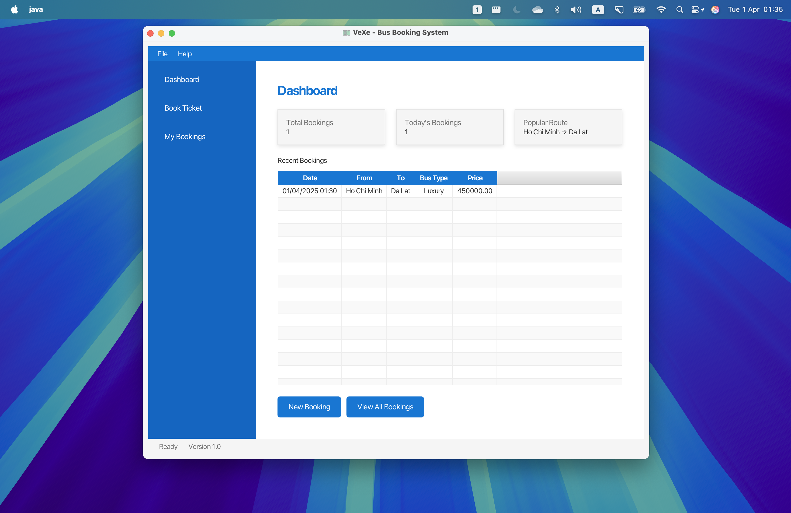
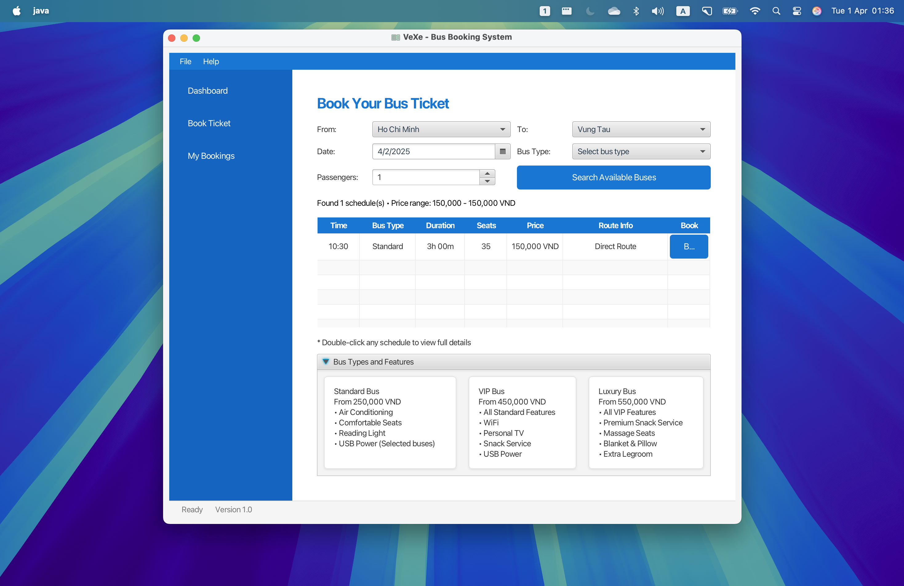
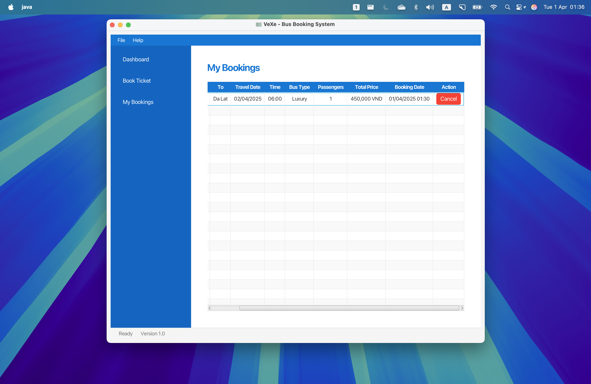

# VeXe Bus Booking System

A modern desktop application for bus ticket booking and management, built with Java Spring Boot and JavaFX.

## Table of Contents
1. [Introduction](#introduction)
2. [Quick Start](#quick-start)
3. [Features](#features)
4. [Setup Guide](#setup-guide)
5. [System Architecture](#system-architecture)
6. [Database Design](#database-design)
7. [User Interface](#user-interface)
8. [Code Structure](#code-structure)
9. [Running the Application](#running-the-application)
10. [Troubleshooting](#troubleshooting)
11. [Development Workflow](#development-workflow)
12. [Screenshots](#screenshots)

## Introduction

VeXe is a modern desktop application for bus ticket booking and management. It's designed to provide a seamless experience for both users and administrators in managing bus schedules, routes, and bookings.

### Purpose
- Simplify bus ticket booking process
- Provide real-time schedule management
- Track booking history and analytics
- Offer a modern, user-friendly interface

### Target Users
- Bus passengers
- Bus operators
- System administrators

## Quick Start

1. **Prerequisites**
   - JDK 23
   - Maven 3.8+
   - PostgreSQL 16+
   - NetBeans IDE 19+ (recommended)

2. **Installation**
   ```bash
   # Clone repository
   git clone https://github.com/YOUR_USERNAME/vexe.git
   cd vexe

   # Create database
   createdb vexe

   # Build and run
   mvn clean javafx:run
   ```

## Features

- User authentication and management
- Bus route and schedule management
- Ticket booking system with real-time updates
- Order history tracking and analytics
- Modern Material Design UI with blue theme
- Responsive dashboard with booking statistics
- Database migrations with Flyway

## Setup Guide

### Prerequisites

1. **Java Development Kit (JDK)**
   - Install JDK 23
   - Download from: https://adoptium.net/
   - Set JAVA_HOME environment variable

2. **NetBeans IDE**
   - Download NetBeans 19 or later
   - Download from: https://netbeans.apache.org/
   - Ensure it's configured to use JDK 23

3. **PostgreSQL**
   - Install PostgreSQL 16
   - Download from: https://www.postgresql.org/download/
   - Remember your postgres user password during installation

4. **Maven**
   - NetBeans includes Maven, but you can install it separately
   - Download from: https://maven.apache.org/
   - Minimum version required: 3.8+

### Database Setup
1. Open pgAdmin or your preferred PostgreSQL client
2. Create a new database:
   ```sql
   CREATE DATABASE vexe;
   ```
3. Configure database connection:
   - Username: postgres
   - Password: postgres
   - Database: vexe
   - Port: 5432

   If you want to use different credentials, update them in:
   `src/main/resources/application.properties`

4. Initialize the database using Flyway migration:
   ```bash
   # Clean and migrate the database
   mvn flyway:clean flyway:migrate
   ```
   This will:
   - Create all required tables (users, buses, routes, bookings, bus_schedules, etc.)
   - Load all sample data for testing

5. Verify the database has been properly set up:
   ```bash
   # Connect to the database
   psql -U postgres -d vexe
   
   # List tables
   \dt
   
   # Check sample data in bus_schedules
   SELECT count(*) FROM bus_schedules;
   
   # Exit psql
   \q
   ```

6. Migration file location:
   - `src/main/resources/db/migration-combined/V1__schema_and_data.sql`: Complete schema and data in a single file

### IDE Setup
1. Open NetBeans
2. Go to File → Open Project
3. Navigate to the cloned vexe directory
4. Select the project and click Open
5. Right-click on the project → Properties
   - Ensure Java platform is set to JDK 23
   - Verify Maven settings are correct

## System Architecture

### Technology Stack
- **Frontend**: JavaFX (Desktop UI)
- **Backend**: Spring Boot (Java)
- **Database**: PostgreSQL
- **Build Tool**: Maven
- **Database Migration**: Flyway

### Architecture Overview
```
┌─────────────────┐     ┌─────────────────┐     ┌─────────────────┐
│                 │     │                 │     │                 │
│  JavaFX UI      │◄───►│  Spring Boot    │◄───►│  PostgreSQL    │
│  (Frontend)     │     │  (Backend)      │     │  (Database)    │
│                 │     │                 │     │                 │
└─────────────────┘     └─────────────────┘     └─────────────────┘
```

## Database Design

### Tables Description

1. **Users Table**
   - Stores user information
   - Fields: id, username, password, email, full_name, phone
   - Used for authentication and user management

2. **Bookings Table**
   - Records all ticket bookings
   - Fields: id, booking_date_time, from_city, to_city, travel_date, travel_time, passenger_count, total_price, bus_type
   - Tracks booking history and information

3. **Buses Table**
   - Manages bus information
   - Fields: id, bus_number, capacity, bus_type
   - Handles bus management

4. **Routes Table**
   - Manages route information
   - Fields: id, origin, destination, distance, duration
   - Handles route management

5. **Bus_Schedules Table**
   - Manages schedule information
   - Relates buses to routes with departure times
   - Fields: id, bus_id, route_id, departure_time, price

## User Interface

### Main Components

1. **Dashboard**
   - Overview of booking statistics
   - Recent activities
   - Quick access to main features

2. **Booking Interface**
   - Route selection
   - Schedule browsing
   - Seat selection
   - Payment processing

3. **My Bookings**
   - Booking history
   - Ticket management
   - Cancellation options

### UI Theme
- Primary Color: #1976D2 (Material Blue)
- Secondary Color: #1565C0 (Darker Blue)
- Accent Color: #2196F3 (Light Blue)
- Background: #F5F5F5 (Light Gray)
- Text: #2C3E50 (Dark Gray)

## Code Structure

### Model Layer
The model layer uses JPA entities with optimized design patterns:

1. **BusSchedule**
   - Simplified amenities handling using `@ElementCollection`
   - Amenities include: WiFi, USB Power, Air Conditioning, etc.
   - Helper methods for amenity checking (e.g., `hasAmenity()`)
   - Clean constructor design without redundant fields

2. **Booking**
   - Efficient JavaFX property handling
   - Automatic property updates with `@PostLoad`
   - Optimized date/time management
   - BigDecimal for precise price calculations

### Service Layer
Services implement business logic with clean separation of concerns:

1. **BusScheduleService**
   - Manages bus schedules and routes
   - Handles amenity-based filtering
   - Provides bus type features and pricing
   - Efficient schedule search algorithms

2. **BookingService**
   - Handles booking creation and management
   - Maintains booking history
   - Provides booking statistics

### Controller Layer
Controllers handle UI logic with modern patterns:

1. **BookingController**
   - Clean separation of UI and business logic
   - Efficient table view management
   - Responsive search functionality
   - Clear error handling and user feedback

2. **MainController**
   - Streamlined navigation
   - Essential menu functionality
   - Focused feature set

### Best Practices
The codebase follows these best practices:

1. **Clean Code**
   - No redundant fields or methods
   - Clear naming conventions
   - Focused class responsibilities
   - Efficient data structures

2. **Performance**
   - Optimized database queries
   - Efficient UI updates
   - Smart caching of common data
   - Minimal memory footprint

3. **Maintainability**
   - Clear code organization
   - Comprehensive documentation
   - Consistent coding style
   - Easy to extend

## Running the Application

### Using NetBeans
1. Right-click on the project
2. Select "Clean and Build"
3. Once build is successful, click "Run"
   - Or use: Run → Run Project

### Using Maven Command Line
You can run the application directly from the command line:

```bash
# Using JavaFX Maven Plugin (default)
mvn clean javafx:run

# Using Exec Maven Plugin
mvn exec:java
```

The application should start and automatically:
- Create database tables (if not exist)
- Run Flyway migrations
- Load sample data
- Launch the JavaFX interface

### Expected Data After Setup

Once the application is set up correctly, you should have:

1. **Bus Routes**: Routes between popular Vietnamese cities
   - Ho Chi Minh City ↔ Da Lat
   - Ho Chi Minh City ↔ Nha Trang
   - Da Lat ↔ Nha Trang

2. **Bus Types**:
   - Standard - Basic service, lower price point
   - VIP - Enhanced comfort, mid-range price
   - Luxury - Premium service with additional amenities

3. **Sample Schedules**:
   - Multiple departure times throughout the day
   - Various price points based on bus type
   - April 2025 sample data loaded

4. **Amenities**:
   - Basic amenities for all buses (Air Conditioning, Comfortable Seats)
   - Enhanced amenities for VIP buses (Snack Service, Personal TV)
   - Premium amenities for Luxury buses (Massage Seats, Blanket & Pillow)

You can verify this data through the application UI or by querying the database directly.

## Troubleshooting

### Database Issues
1. If you get connection errors:
   - Verify PostgreSQL is running (`pg_isready` command)
   - Check credentials in application.properties
   - Ensure database 'vexe' exists

2. If migrations fail:
   ```bash
   # Connect to database
   psql -U postgres -d vexe

   # Check migration status
   SELECT * FROM flyway_schema_history;
   
   # Look for failed migrations (success = 0)
   SELECT * FROM flyway_schema_history WHERE success = 0;

   # Exit psql
   \q
   
   # Reset and rerun migrations if needed
   mvn flyway:clean flyway:migrate
   
   # Or use the combined migration approach
   mvn flyway:clean flyway:migrate -Dspring.profiles.active=combined
   ```

3. Common Flyway errors:
   - **Migration checksum mismatch**: You've modified a migration file that was already applied
     ```bash
     # Fix by cleaning and migrating (WARNING: This will DELETE all data)
     mvn flyway:clean flyway:migrate
     
     # Or try the combined migration approach instead
     mvn flyway:clean flyway:migrate -Dspring.profiles.active=combined
     ```
   
   - **Can't find migration files**: Check that files are in the correct directory
     - Combined migration: `src/main/resources/db/migration-combined`
   
   - **Schema version table exists but is empty**: Database is in an inconsistent state
     ```bash
     # Repair the Flyway schema history table
     mvn flyway:repair
     
     # Then run migrations again
     mvn flyway:migrate
     ```

4. When switching between migration approaches:
   ```bash
   # Always clean before switching approaches
   mvn flyway:clean -Dspring.profiles.active=combined
   ```

5. Manually check tables:
   ```bash
   # Connect to database
   psql -U postgres -d vexe
   
   # Check bus_schedules content
   SELECT * FROM bus_schedules LIMIT 5;
   
   # Check related tables
   \d+ bus_schedules
   \d+ bookings
   ```

### Build Issues
1. Maven dependency problems:
   ```bash
   mvn clean install -U
   ```

2. JavaFX not found:
   - Verify JavaFX dependencies in pom.xml
   - Check Java version compatibility
   - Make sure your JDK has the appropriate modules

### Runtime Issues
1. Port conflicts:
   - Check if PostgreSQL is running on default port 5432
   - Verify no other application is using required ports

2. JavaFX module issues:
   - If running from command line and getting module errors, try using the JavaFX Maven plugin:
   ```bash
   mvn javafx:run
   ```

## Development Workflow
1. Always pull latest changes before starting work:
   ```bash
   git pull origin main
   ```

2. Create feature branch:
   ```bash
   git checkout -b feature/your-feature-name
   ```

3. Regular commits:
   ```bash
   git add .
   git commit -m "Descriptive message"
   git push origin feature/your-feature-name
   ```

## Screenshots

### Dashboard View

*Main dashboard showing booking statistics and recent activities*

### Booking Interface

*Bus ticket booking interface with schedule selection*

### My Bookings

*User's booking history and management*

## Testing and Deployment

### Testing
1. **Unit Testing**
   ```bash
   mvn test
   ```

2. **Integration Testing**
   - Database integration tests
   - UI component tests

### Deployment
1. **Build Process**
   ```bash
   mvn clean package
   ```

2. **Database Migration**
   ```bash
   mvn flyway:migrate
   ```

## Contributing

1. Fork the repository
2. Create your feature branch: `git checkout -b feature/your-feature-name`
3. Commit your changes: `git commit -m 'Add some feature'`
4. Push to the branch: `git push origin feature/your-feature-name`
5. Open a Pull Request

## License

This project is licensed under the MIT License - see the LICENSE file for details.