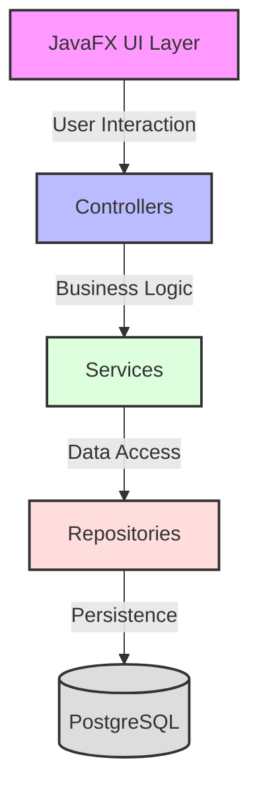
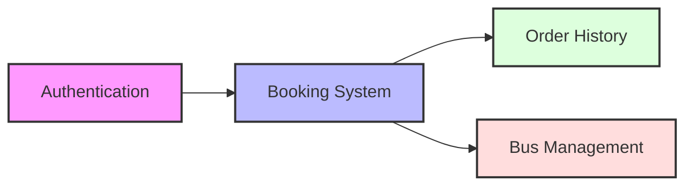
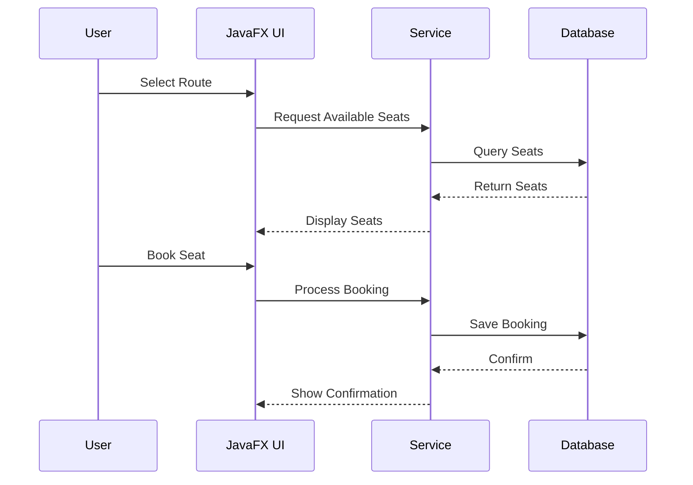

# System Patterns

## Architecture Overview

## Design Patterns
### Architectural Patterns
- **MVC Pattern**: Separation of UI, business logic, and data
- **Repository Pattern**: Data access abstraction
- **Service Layer Pattern**: Business logic encapsulation
- **DTO Pattern**: Data transfer between layers

### Implementation Patterns
- **Builder Pattern**: For complex object construction
- **Factory Pattern**: For object creation
- **Singleton Pattern**: For shared resources
- **Observer Pattern**: For UI updates

## Component Relationships
### Core Components

## Data Flow
### Booking Flow

## Security Patterns
- Basic authentication for prototype
- Password encryption
- Session management
- Role-based access control

## Notes
- Architecture focuses on maintainability and extensibility
- Clear separation of concerns between layers
- Modular design for easy feature addition
- Emphasis on data consistency and transaction management
- This document will be updated as we make architectural decisions
- All technical decisions should be documented here
- Patterns should be consistent across the system 